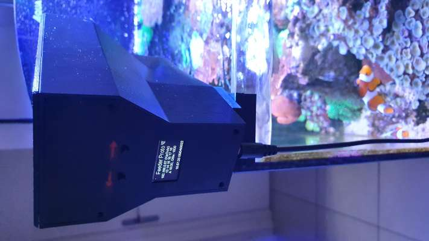
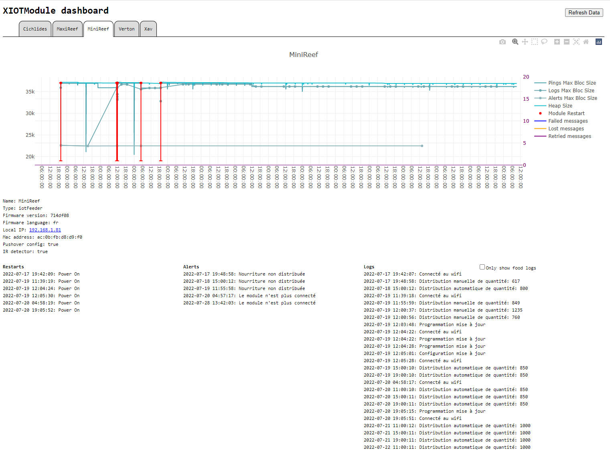

# iotFeeder

WiFi enabled fish feeder for aquarium, using an ESP8266, a stepper motor and an oled screen.

All settings are done using web page forms over Wifi. It records activiyy in a Firebase DB, and you will receive notifications when it's empty or offline.


```
DISCLAIMER of liability: this is a (fish) life sustaining device, all files are provided with no warranty of any kind. 

Building this device using these files and instructions means you implicitely accept to use it at your own risk, with proper supervision and monitoring to ensure your fishes are indeed fed as they should.

I can't be held responsible for any damage occurring while using a device you built using these files and instructions, whatever the reason (design flaw, software bug, ...)

If you do not agree with this disclaimer, do not build this device, or do not use it.
```

I've built 7 feeders with food IR detection (and one without), and a friend has built one.

5 are currently installed on small to big recifal fish tanks (salted water, tropical fishes and corals), and one on freshwater tank, running with no issue since begining of May 2022 for 2 of them, and since mid July 2022 for three more.

It will eventually be a module of the Iotinator framework (https://github.com/reivaxy/iotinator), but it can already work autonomously (no master module is needed).

It connects to your home Wifi network to fetch date/time and posts logs and alerts to Firebase (Google Cloud free account) as well as send push notifications when it detects that it's empty. Firebase will also send you push notifications when the module seems to be disconnected (power outage, wifi outage...)

It keeps working even if wifi goes out, but you'll get disconnection notifications, thanks to a google cloud function checking for ping records every 5mn.

Notifications are sent using Pushover.net, using a one-time fee plan (about $5).

Logs and alerts are available on a google cloud application page:




It's using cheap and widely available components (each under $4), a 3D printed case, and an optional but recommended PCB.

Firebase is used within the free offer allowances, so the overall cost should not exceed about $25.

The ESP8266 allows some WiFi access for setting the feeding times and quantities, as well as OTA firmware upgrade, the tiny Oled screen displays what's going on, and one push button helps calibrating the quantities as well as manually treat your little fishes when they deserve it.

The stepper motor allows controling with precision the amount of food dispensed.

Here is the overall aspect of the 3D printed case (before the addition of IR food dispensing detection)


Here is a working prototype:


The 3D design is using an Archimedes' screw:


Here is a short demo with the prototype showing the configuration page, then the Oled screen, then the dispensing of one programmed serving.

https://youtu.be/9wqxyTTBjuU


## BUILDING YOURS

If you intend to build one, please first check the [wiki for assembling instructions](https://github.com/reivaxy/iotFeeder/wiki) with many pictures (work in progress).

And feel free to let me know, I might help with suggestions or latest info not already updated here.

I also offer to send you free of charge the two very tiny PCBs needed for the infrared sensors, since I have a few hundreds of them.


## COMPONENTS NEEDED

I've used this stepper driver board but I guess others should work:


https://www.ebay.com/itm/263017459366

To use them with the [PCB available here](hardware/PCB), you will need to unsolder the headers and solder them on the other side of the driver PCB, which is not ideal. 

This driver board was obviously not intended to be mounted on proto board but if you push hard enough, it fits :)

I might end up designing another PCB with an SMD MPF10S equivalent and the few discreete components needed to get rid of the driver board.

I've used this stepper, so the case is designed to accomodate it, but since it's mounted on an [independant plate](https://github.com/reivaxy/iotFeeder/blob/master/hardware/3DFiles/stepperPlate.stl), adaptation to another stepper could be easy if within the overall dimensions.


https://www.ebay.com/itm/262537288016


Other components easy to find anywhere:

1 x ESP12 but it also works on a D1_mini or node MCU.

1 x LM1117 regulator (the stepper is 6V, the ESP 3.3V)

1 x Oled 0.96inch white pixels (the split blue & yellow screen does not age as well, and be careful with the power pins, some are reversed)

2 x push buttons (can be mounted on the [PCB](hardware/PCB) or wired)

5 x 10kΩ to 22kΩ resistors (SMD 0806 if you use the [PCB](hardware/PCB))

1 x 100Ω resistor (SMD 0806 if you use the [PCB](hardware/PCB))

1 x 51Ω resistor (SMD 0806 if you use the [PCB](hardware/PCB))

2 x 10µF capacitors (SMD 0806 if you use the [PCB](hardware/PCB))

1 x 6V power unit. The module needs about 500mA at peak when stepper starts, 100mA when idle 

1 x power jack socket

2 x 6800ZZ bearings

2 hex bolts m3x16 to mount the stepper on the stepper plate


8 Philips self tapping flat head screws m2x12 : 
- 4 to attach the stepper plate to the case
- 4 to attach the back panel to the case

 About 160g of PLA filament.
